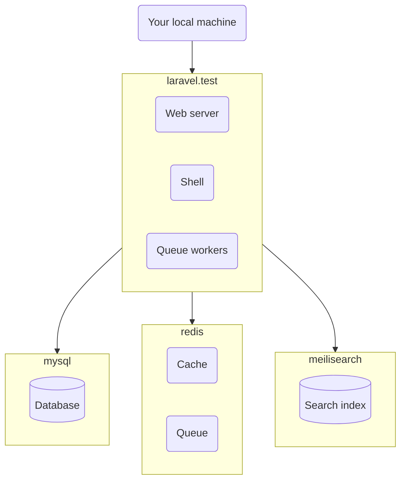
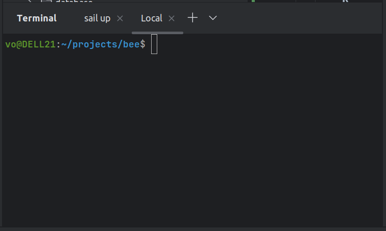

# Bee

* [Introduction](#introduction)
* [Local development](#local-development)
    * [Docker](#docker) 
    * [Prerequisites](#prerequisites)
    * [Installation](#installation)
    * [PHPStorm (optional)](#phpstorm--optional-)
* [License](#license)
 
## Introduction

Bee is a set of command-line and UI tools that automate my personal workflow.

It's still an early effort, and it doesn't do anything especially useful. Yet, I develop it in public for two reasons:

1. Anything useful to me may also be useful to someone else, and even if it's a single person, sharing makes the world a bit better place.
2. Building things in public produces better results faster.

## Local development

### Docker

Locally, develop the project using Docker:

As you can see in the `docker-compose.yml`, it uses 4 containers:

* `laravel.test` container runs PHP code - handles HTTP requests, runs CLI commands, executes queued jobs.
* `mysql` container stores the database.
* `redis` container is currently not involved, but it will store the cache and the queue.
* `meilisearch` container is currently not involved, but it will store the search index.

### Prerequisites

Before installing the project:

* Install PHP on your machine.
* Install Composer on your machine.
* Install Node.js on your machine.
* Install Docker 2.
* Install Docker Compose.
* Install PHPStorm (optional).
* Create the `sail` shell alias.

### Installation

Install the project in the `~/projects/bee` directory (the project directory):

1. Download and prepare the project files using the following commands:
 
        cd ~/projects
        git clone git@github.com:osmianski/bee.git
        cd bee
        npm install

2. In a separate terminal window, start the Docker containers by running the following command in the project directory, and keeping it running there:

        sail up

3. Create the database by running the following command in the project directory:

        sail artisan migrate:fresh --seed

### PHPStorm (optional)

1. During the development, keep 2 separate terminal windows, one with the `sail up` command running in the background, and the other for executing arbitrary commands:

    

## License

Bee is open-sourced software licensed under the [MIT license](https://github.com/osmianski/bee/blob/HEAD/LICENSE.md).
